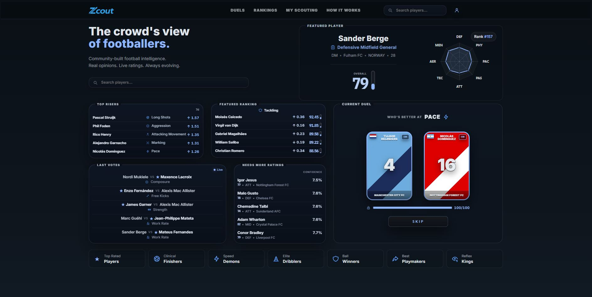
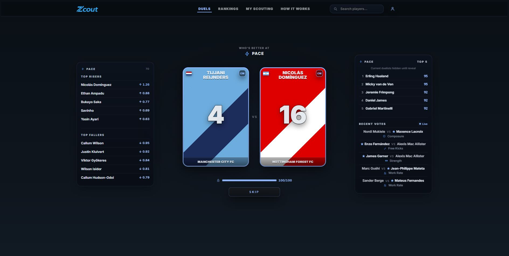
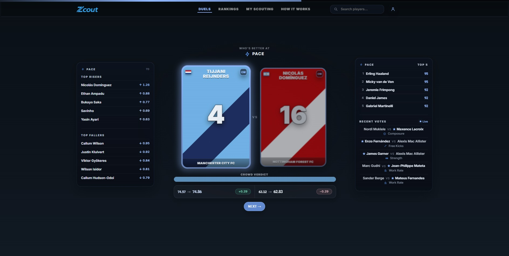
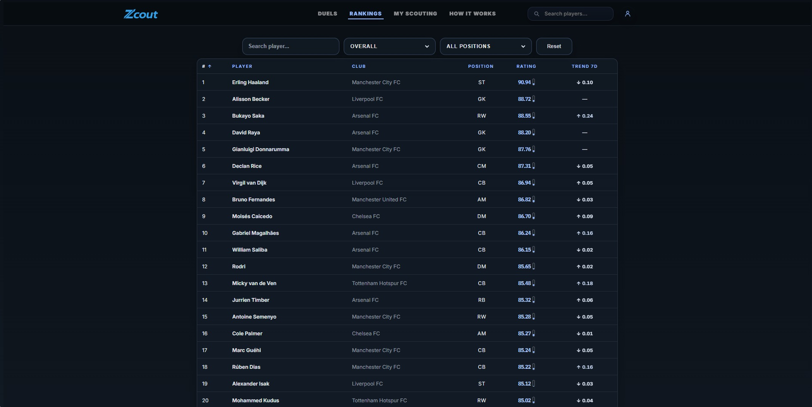
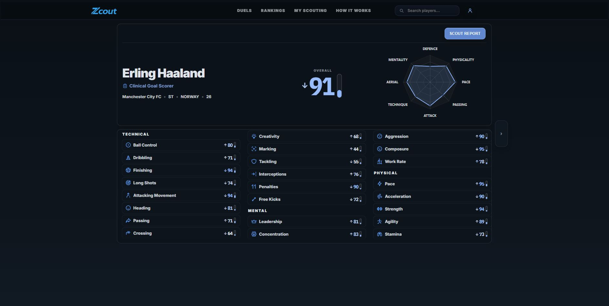

# Zcout Frontend

Frontend application for Zcout - a football crowd-scouting platform built around fast player duels, live rankings and evolving player profiles.

Inspired by Football Manager-style scouting and designed around ultra-fast interaction loops.

---

# Screenshots

## Homepage



## Duel Experience



## Crowd Reveal



## Rankings



## Player Profile



---

# Core Features

- Homepage product screen (hero, featured player, embedded duel, live widgets)
- Instant duel flow + crowd reveal
- Live rankings
- Player profiles with radar charts + archetypes
- Scout reports (profile modal)
- My Scouting progression dashboard
- Homepage / nav search (SQL-backed; players shown in UI)
- Anonymous voting + claim after auth
- Responsive layouts, FM-inspired visual design
- Real-time live widgets (Soketi / Echo)

---

# Tech Stack

- Next.js 15
- React
- TypeScript
- SSR + Client Components
- CSS Modules
- ECharts
- Soketi / Pusher realtime
- Docker

Frontend architecture focuses on:

- fast first-load experience,
- low-friction interactions,
- responsive UI flows,
- lightweight navigation,
- server/client rendering balance.

---

# Frontend Infrastructure

The frontend is deployed as a prebuilt Docker image.

Production flow includes:

- GitHub Actions CI pipeline,
- GitHub Container Registry (GHCR),
- artifact-based deployments,
- Dockerized runtime environment,
- Nginx reverse proxy integration.

The production VPS acts as a runtime-only environment without local frontend builds.

# Product Philosophy

Zcout is built around a simple interaction loop:

```text
duel → decision → crowd reveal → next duel
```

The frontend is intentionally optimized for:

- immediate interaction,
- minimal onboarding,
- fast feedback,
- low cognitive load,
- continuous curiosity loops.

The goal is to make football scouting feel interactive and alive rather than static.

---

# Key Frontend Areas

## Duel Experience

- fullscreen player cards
- instant voting interactions
- animated crowd reveal
- hover / transition effects
- low-latency navigation

## Rankings

- attribute filtering
- responsive ranking layouts
- confidence display
- live movement indicators

## Player Profiles

- radar charts
- attribute groups
- confidence-aware presentation
- crowd vs personal ratings
- live movement indicators

## Scout Reports

- slider-based rating input
- lightweight UX
- blind-first rating flow
- minimal friction interaction design

---

# Project Structure

```text
src/
├── app/
├── components/
└── lib/
```

Main responsibilities:

```text
app/         → routes, layouts, pages
components/  → reusable UI components
lib/         → utilities, helpers, API logic
```

---

# Running Locally

## Requirements

- Node.js
- Docker (optional)

## Install dependencies

```bash
npm install
```

## Run development server

```bash
npm run dev
```

## Build production version

```bash
npm run build
```

## Start production server

```bash
npm run start
```

---

# Environment Variables

Example variables:

```env
NEXT_PUBLIC_API_BASE=http://localhost:8000/api
NEXT_PUBLIC_PUSHER_APP_KEY=local
NEXT_PUBLIC_PUSHER_HOST=localhost
NEXT_PUBLIC_PUSHER_PORT=6001
```

See `.env.example` for full configuration.

---

# Current MVP Scope

Implemented (high level):

- Homepage, duel flow, reveal, rankings, profiles, scout-report modal
- Search (players), realtime widgets, anonymous voting + claim
- My Scouting unlock / dashboard

Partial / shelved:

- Your Impact content (locked stub)
- `/database` entry redirects away; club pages not in nav
- Club hits from search API not shown in dropdown

Planned expansions:

- Player comparison
- Historical attribute timelines
- Your Impact / insight drops content
- Further polish & discovery features

---

# Design Direction

The UI aims to combine:

- Football Manager-inspired structure,
- modern responsive frontend patterns,
- low-friction mobile-first interaction,
- subtle animation-driven feedback.

The frontend intentionally prioritizes:

- speed,
- clarity,
- responsiveness,
- interaction feel.

---
